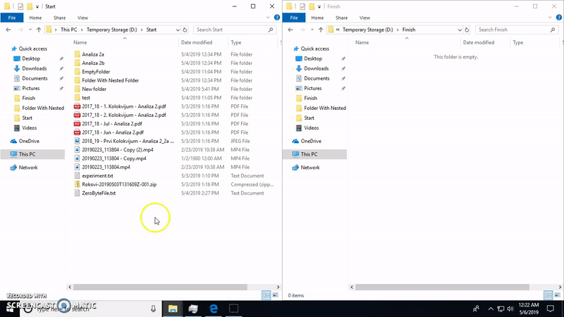

# Multithread Windows Copy

## Summary
Copy/cut/paste features using Windows **robocopy** command with the same interface as traditional Windows explorer copy/paste.
Select the files you wish to copy, *right-click->robo-copy* or *right-click->robo-cut* and then paste them to destination folder using *right-click->robo-paste*. By default, **8 threads** are used to copy selected files and folders.  
For details about robocopy see [robocopy | Microsoft Docs.](https://docs.microsoft.com/en-us/windows-server/administration/windows-commands/robocopy)  

## Demo  
[Link to full 2 minute installation, usage and unistallation process.](RoboCopyDemo.mp4)  
  

## Languages and technologies used
* Implementation is in C#, and all the code was written using Visual Studio.
* To communicte with Windows and Windows Explorer we used functions exposed in [kernel32.dll](http://pinvoke.net/default.aspx/kernel32/_ContentBaseDefinition.html) and [user32.dll](http://pinvoke.net/default.aspx/user32/_ContentBaseDefinition.html).
* [Notepad++](https://notepad-plus-plus.org/) is used for installation script and readme editing.   
* [Nullsoft scriptable install system (NSIS)](https://nsis.sourceforge.io/) is used to create installation wizard.

## Installation
Simple installation using installation wizard ([Link](https://github.com/matf-pp2019/Windows_copy/releases/download/v1.0/MultithreadWindowsCopyInstaller.exe)).

## Compatibility 
Currently, the feature is tested only on Windows 10.  
Further testing on other Windows versions supporting robocopy (*Windows Vista* and later and *Windows Server 2008* and later) is in progress.

## Notes
- File overwritting is turned on by default.
- We will not be working on advanced features, like custom number of threads and optional copy-and-replace (turned on by default), because for
some unknown reason robocopy freezes when these two flags are turned on.  

## Authors
Marija Katic, contact: *mr16032 et alas.matf.bg.rs*  
Jovan Milenkovic, contact: *mr16006 et alas.matf.bg.ac.rs*  
